# 🛍️ ShopWave – Modern React E-Commerce Website

ShopWave is a modern and responsive e-commerce website built using React.js. The project showcases a premium shopping experience with stylish UI components, product listings, customer reviews, shopping cart functionality, and React Router navigation.

---

## 🚀 Features

- Modern and Responsive UI
- React Component-Based Architecture
- React Router Navigation
- Premium Hero Section
- Product Showcase
- Category Section
- Customer Reviews
- Shopping Cart
- Toast Notifications
- About Us Page
- Mobile-Friendly Design

---

## 🛠️ Technologies Used

- React.js
- JavaScript (ES6+)
- HTML5
- CSS3
- React Router DOM

---

### 📂 Project Structure

```text
src/
│
├── components/
│   ├── Navbar.jsx
│   ├── Navbar.css
│   ├── Hero.jsx
│   ├── Hero.css
│   ├── Marquee.jsx
│   ├── Marquee.css
│   ├── Features.jsx
│   ├── Features.css
│   ├── CategoryShowcase.jsx
│   ├── ProductGrid.jsx
│   ├── ProductGrid.css
│   ├── ProductCard.jsx
│   ├── ProductCard.css
│   ├── Reviews.jsx
│   ├── Reviews.css
│   ├── Cart.jsx
│   ├── Cart.css
│   ├── Footer.jsx
│   ├── Footer.css
│   ├── Toast.jsx
│   ├── Toast.css
│   └── products.jsx
│
├── images/
│   ├── cart.png
│   ├── categories.png
│   ├── footer.png
│   ├── home1.png
│   ├── home2.png
│   ├── products1.png
│   ├── products2.png
│   ├── products3.png
│   ├── products4.png
│   └── reviews.png
│
├── pages/
│   ├── About.jsx
│   ├── home.jsx
│   ├── ProductsPage.jsx
│   └── ReviewsPage.jsx
│
├── App.js
├── App.css
└── index.js
```
## 🔗 Routes

| Route | Description |
|---------|------------|
| `/` | Home Page |
| `/products` | Products Page |
| `/reviews` | Customer Reviews |
| `/about` | About ShopWave |

---

## 📸 Screenshots

### Home Page

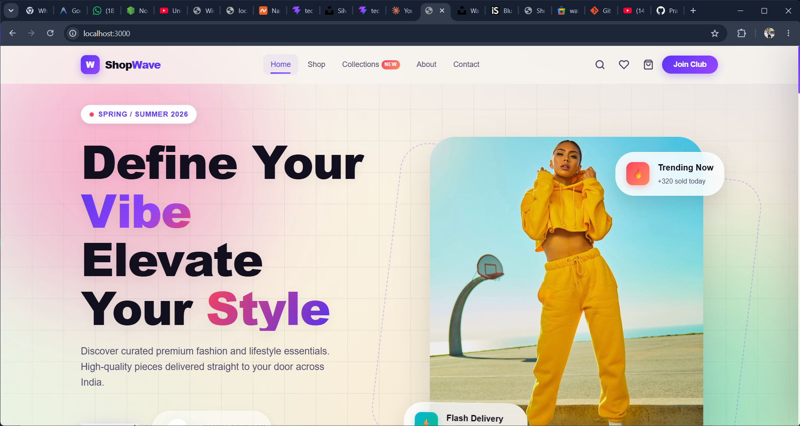
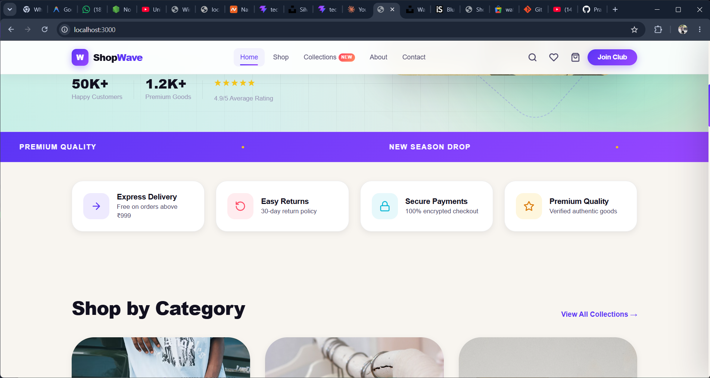

### Categories

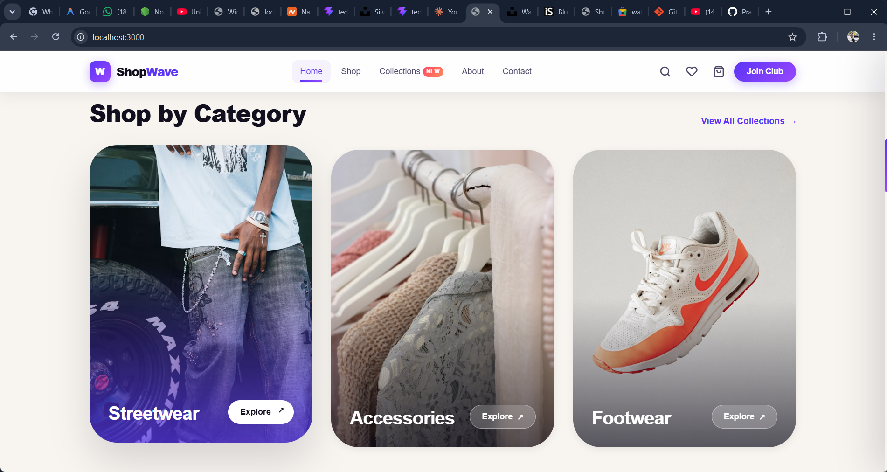

### Products Page

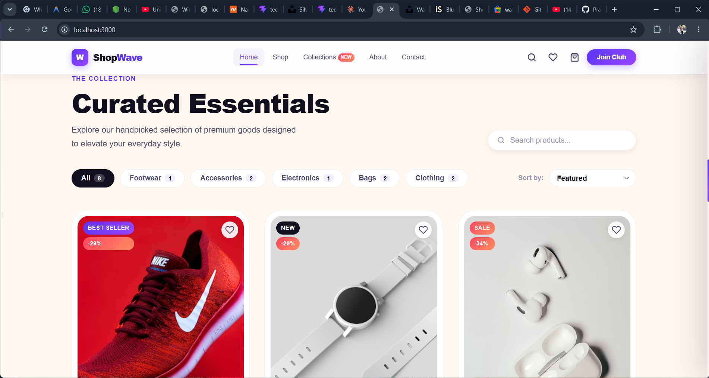
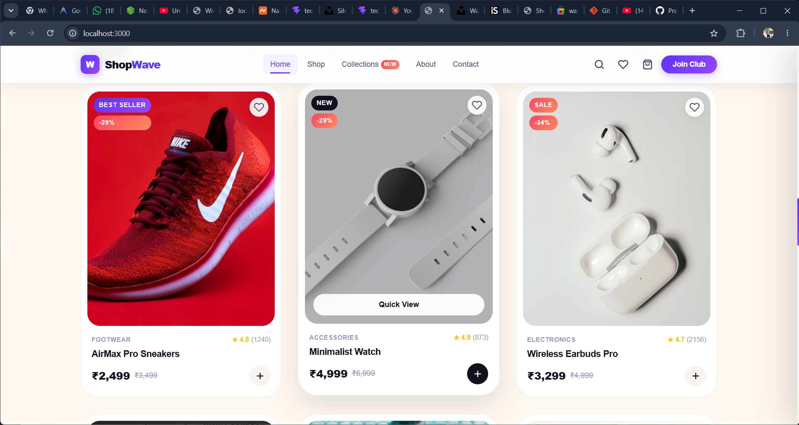
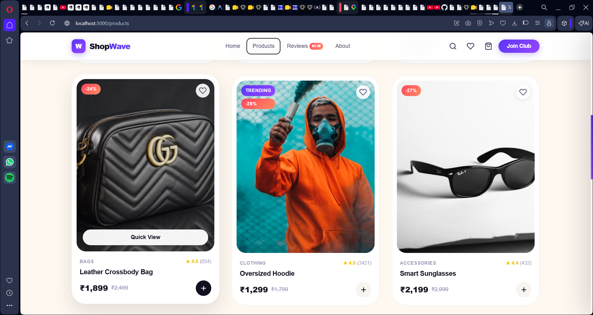
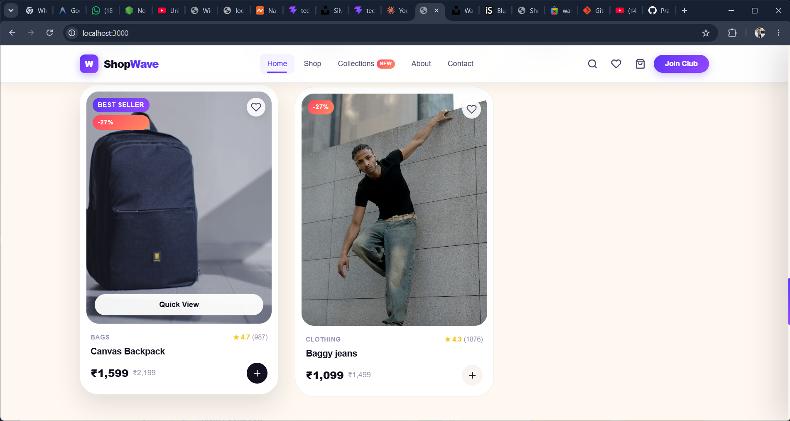

### Cart section

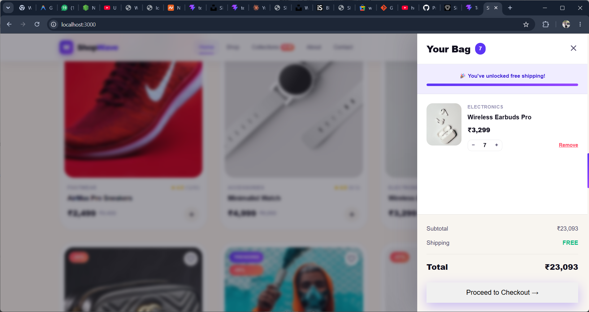

### Reviews Page

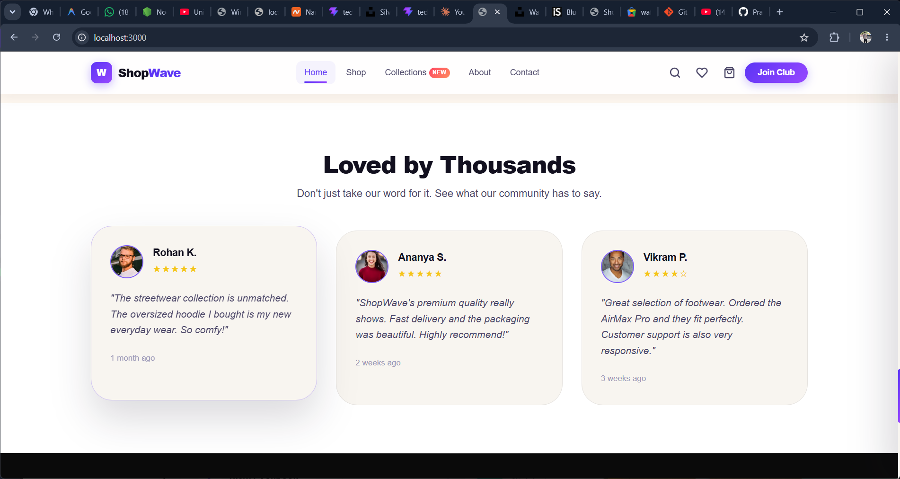

### About Page

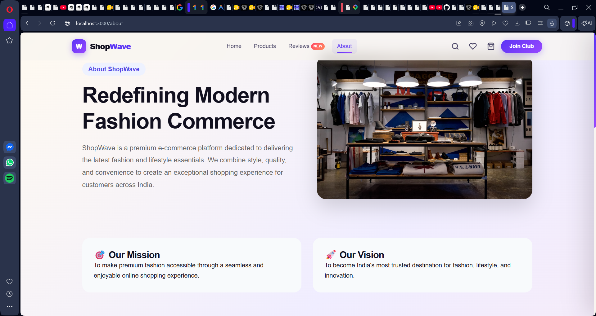


### Footer

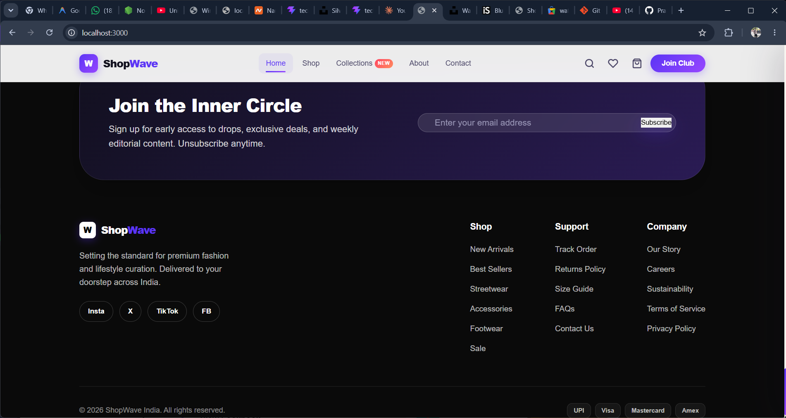

---

## ⚙️ Installation

Clone the repository:

```bash
git clone https://github.com/Prathamisgoated/ecommerce-site.git
```

Navigate into the project:

```bash
cd ecommerce-site
```

Install dependencies:

```bash
npm install
```

Start the development server:

```bash
npm start
```

---

## 🎯 Learning Outcomes

This project helped demonstrate:

- React Components
- Props and State Management
- React Hooks
- Event Handling
- Conditional Rendering
- React Router DOM
- Responsive Web Design
- Modern UI/UX Principles

---

## 👨‍💻 Author

**Pratham Prakash Chaudhari**

---

## ⭐ Future Improvements

- Product Search Functionality
- User Authentication
- Wishlist System
- Payment Gateway Integration
- Backend Integration
- Order Tracking