# 🛍️ ShopWave

ShopWave is a modern full-stack ecommerce web application built with React and Supabase. It provides a complete online shopping experience with user authentication, product browsing, wishlist management, shopping cart, secure checkout, order history, and inventory management.

---

## 🚀 Features

### 👤 User Authentication
- Sign Up & Login
- Secure authentication using Supabase Auth
- Protected checkout

### 🛒 Shopping
- Browse products
- Product categories
- Product search
- Product details page
- Add to Cart
- Quantity management

### ❤️ Wishlist
- Add products to wishlist
- Remove products from wishlist
- Persistent wishlist using Supabase

### 📦 Orders
- Secure checkout
- Order Success page
- Order History
- Delivery information
- Stores orders in Supabase

### 📊 Inventory Management
- Live stock display
- Automatic stock reduction after successful purchase
- Out of Stock handling

### ⭐ Product Information
- Product ratings
- Reviews count
- Brand information
- Discount calculation
- Product badges

### 🎨 UI
- Responsive Design
- Modern animations
- Toast notifications
- Clean shopping experience

---

## 🛠️ Tech Stack

### Frontend
- React.js
- React Router DOM
- CSS3

### Backend
- Supabase
- PostgreSQL
- Supabase Authentication

### Deployment
- Vercel

---

---

### 📂 Project Structure

```text
src/
│
├── components/
│   ├── Navbar.jsx
│   ├── Navbar.css
│   ├── Hero.jsx
│   ├── Hero.css
│   ├── Marquee.jsx
│   ├── Marquee.css
│   ├── Features.jsx
│   ├── Features.css
│   ├── CategoryShowcase.jsx
│   ├── ProductGrid.jsx
│   ├── ProductGrid.css
│   ├── ProductCard.jsx
│   ├── ProductCard.css
│   ├── Reviews.jsx
│   ├── Reviews.css
│   ├── Cart.jsx
│   ├── Cart.css
│   ├── Footer.jsx
│   ├── Footer.css
│   ├── Toast.jsx
│   ├── Toast.css
│   └── products.jsx
│
├── images/
│   ├── cart.png
│   ├── categories.png
│   ├── footer.png
│   ├── home1.png
│   ├── home2.png
│   ├── products1.png
│   ├── products2.png
│   ├── products3.png
│   ├── products4.png
│   └── reviews.png
│
├── pages/
│   ├── About.jsx
│   ├── home.jsx
│   ├── ProductsPage.jsx
│   └── ReviewsPage.jsx
│
├── App.js
├── App.css
└── index.js
```
## 🔗 Routes

| Route | Description |
|---------|------------|
| `/` | Home Page |
| `/products` | Products Page |
| `/reviews` | Customer Reviews |
| `/about` | About ShopWave |

---

## 📸 Screenshots

### Home Page

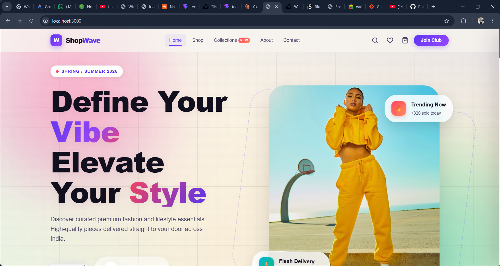
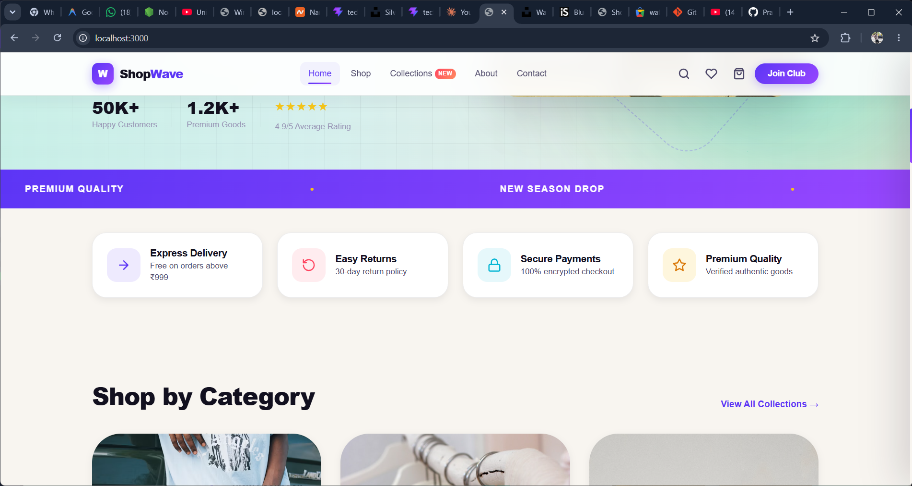

### Categories

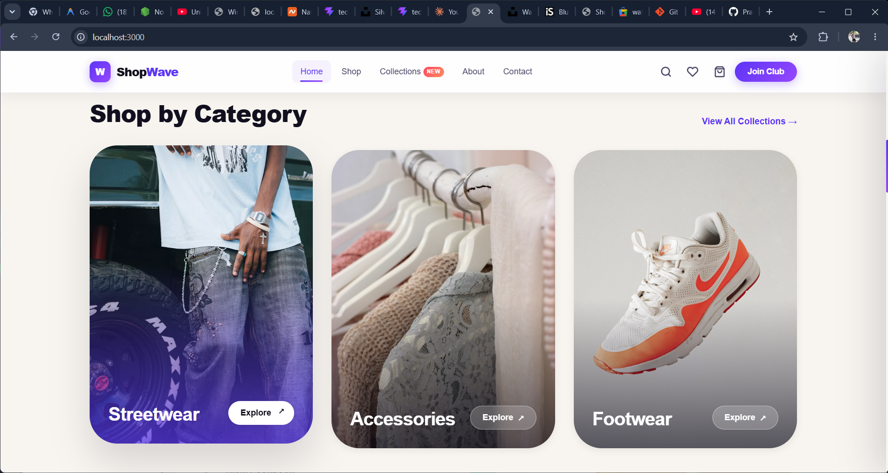

### Products Page

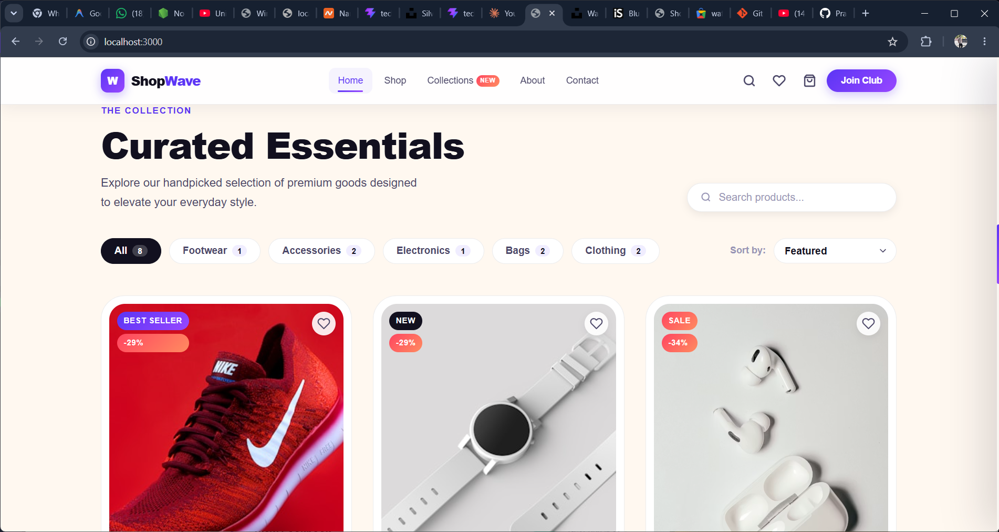
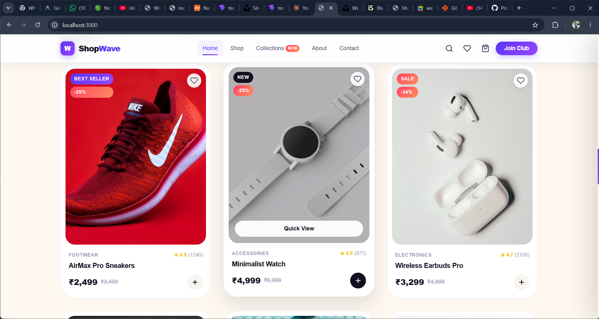
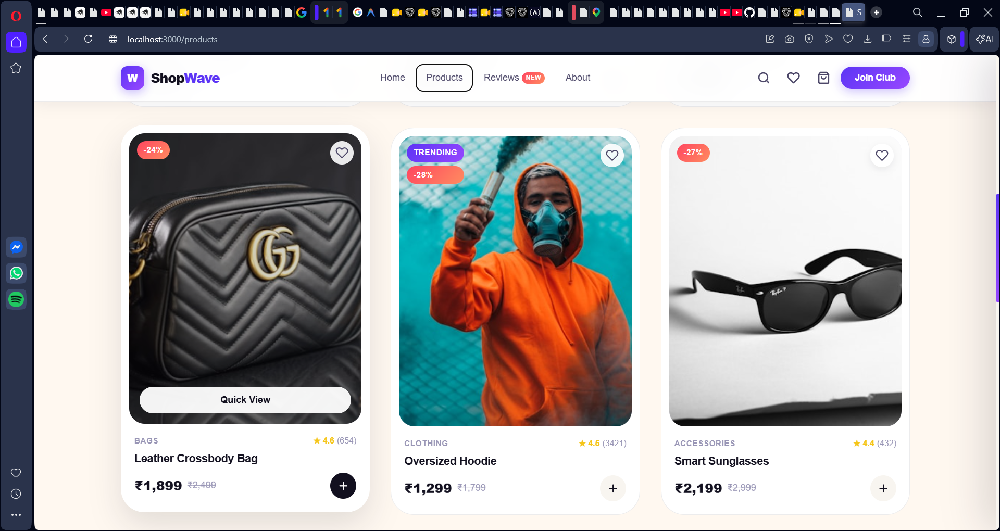
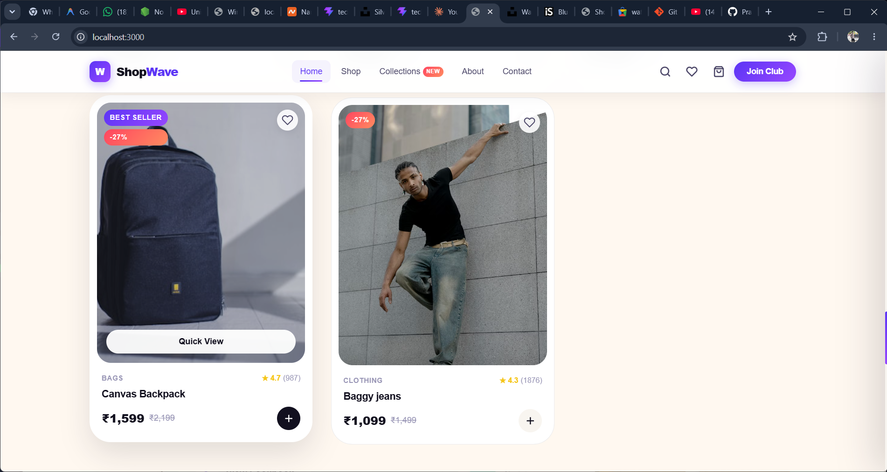

### Cart section

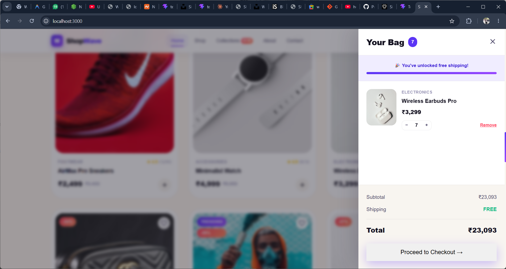

### Reviews Page

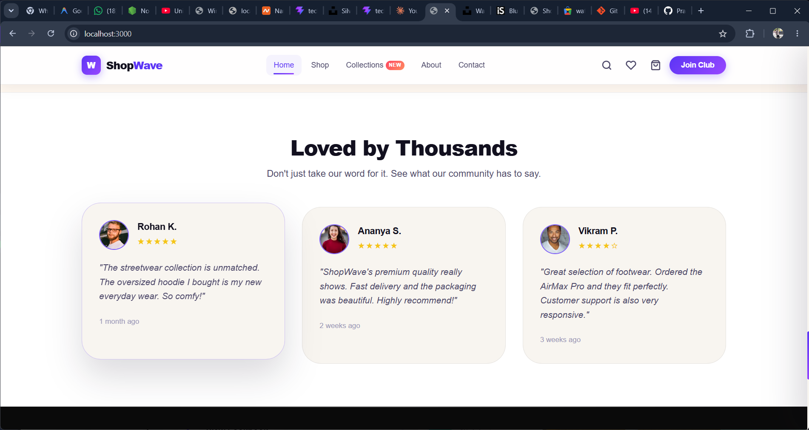

### About Page

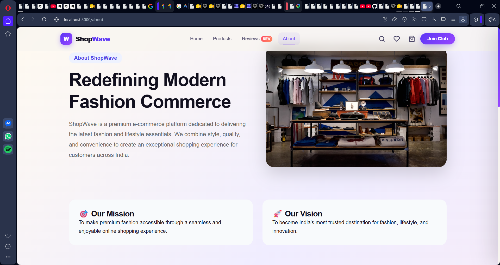


### Footer

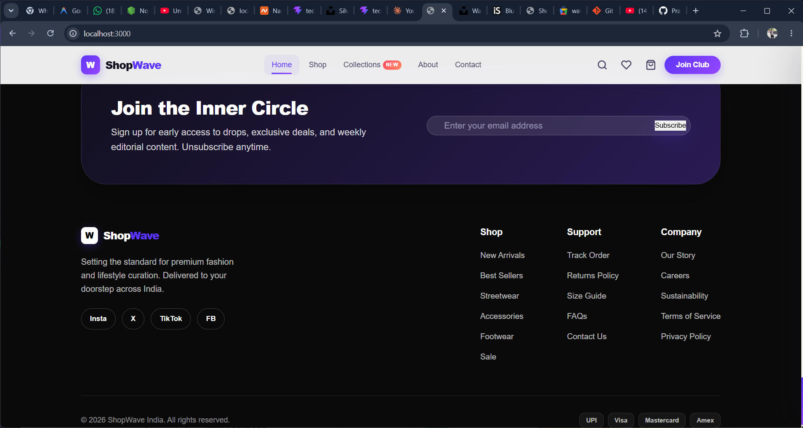

---

## ⚙️ Installation

Clone the repository:

```bash
git clone https://github.com/Prathamisgoated/ecommerce-site.git
```

Navigate into the project:

```bash
cd ecommerce-site
```

Install dependencies:

```bash
npm install
```

Start the development server:

```bash
npm start
```

---

## 🎯 Learning Outcomes

This project helped demonstrate:

- React Components
- Props and State Management
- React Hooks
- Event Handling
- Conditional Rendering
- React Router DOM
- Responsive Web Design
- Modern UI/UX Principles
- Backend integration

---

## 👨‍💻 Author

**Pratham Prakash Chaudhari**

---

